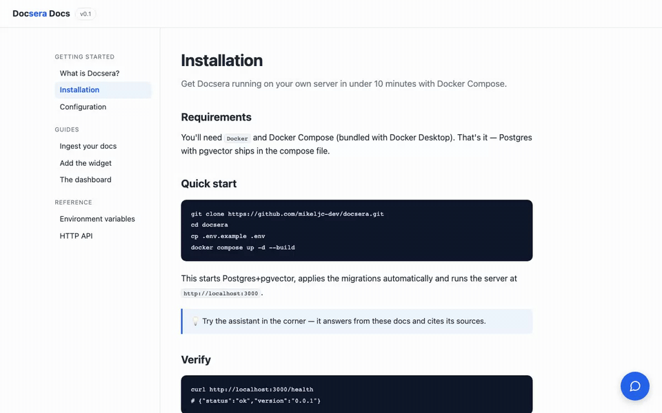

<div align="center">

# Docsera

[](https://github.com/mikeljc-dev/docsera/actions/workflows/ci.yml)

**Chat con IA sobre tu documentación. Open source, self-hosted, en una línea.**

Instala un asistente inteligente sobre tus docs con un solo `<script>`.
Tus datos no salen de tu servidor. Funciona con Anthropic, OpenAI o modelos locales.

[docsera.dev](https://docsera.dev) · [Instalación](#instalación) · [Uso](#uso) · [Configuración](#configuración) · [Cómo funciona](#cómo-funciona) · [Roadmap](#roadmap) · [Licencia](#licencia)

[English](./README.md) · **Español**

</div>

> **Estado: v0.4.0.** Server, ingesta, chat con RAG y citas, widget,
> dashboard y Docker funcionan de extremo a extremo. Proyecto joven —
> feedback e issues muy bienvenidos (ver [Roadmap](#roadmap)).

---

## Demo



*(Grabación real de la [demo pública](https://docs.docsera.dev/?demo=1): una
respuesta con citas por sección, y una pregunta fuera de tema respondida con
un honesto "I don't know" — sin llegar a llamar al LLM. Pruébalo tú mismo —
la burbuja de chat de esa página es Docsera corriendo sobre sus propias docs.)*

## ¿Qué es?

Docsera es un widget embebible que responde preguntas sobre tu documentación usando IA, **con citas a las fuentes**. Piensa en el chat de soporte de Intercom, pero open source y que puedes alojar tú mismo.

- **Instalación en < 10 minutos** con Docker Compose.
- **Privacy-first**: en modo self-hosted, los datos nunca salen de tu servidor (salvo las llamadas al proveedor de LLM que tú elijas).
- **Agnóstico de LLM**: Anthropic, OpenAI o modelos locales vía Ollama — para chat y para embeddings, por separado.
- **Respuestas con fuentes**: cada respuesta enlaza a la sección de donde salió. Antes de inventar, responde "No lo sé."

## ¿Cómo se compara?

Productos como **Intercom Fin, el asistente de Mintlify, DocsBot o kapa.ai** resuelven el mismo problema como servicio gestionado: tus docs y las preguntas de tus usuarios pasan por su infraestructura, con los modelos que ellos gestionan, por suscripción. Docsera es la versión open source y self-hosted de la misma idea:

| | Docsera | Alternativas gestionadas |
|---|---|---|
| Código | Abierto (AGPL-3.0) | Propietario |
| Dónde corre | Tu servidor | Su nube |
| Dónde viven tus datos | Tu Postgres | Su infraestructura |
| LLM | El que elijas — Anthropic, OpenAI, cualquier API compatible, o totalmente local vía Ollama | El que ellos gestionan |
| Coste | Gratis — tu infra más el uso de LLM opcional | Suscripción |

Si quieres un producto gestionado, sin operaciones y con soporte detrás, las opciones hosted son excelentes. Si quieres control, privacidad y cero vendor lock-in — para eso existe Docsera.

## Cómo funciona

Tres piezas dentro de un monorepo, todas dentro de un único servicio desplegable:

| Paquete | Qué hace |
|---|---|
| `packages/server` | La API: `POST /chat` (RAG con citas), `POST /chat/stream` (lo mismo, en streaming por SSE — es lo que usa el widget), `POST /ingest` (markdown/URL/sitemap/GitHub), `POST /mcp` (servidor MCP para agentes de IA), `GET /llms.txt`, y sirve el widget y el dashboard como estáticos |
| `packages/widget` | El web component embebible (el chat flotante), compilado a un único `widget.js` |
| `packages/dashboard` | Panel de administración: analíticas de cobertura (tasa de respuesta, top preguntas sin responder, secciones más citadas, feedback) e historial de conversaciones |
| `packages/web` | La landing de [docsera.dev](https://docsera.dev) (estática; no forma parte del producto desplegable) |
| `packages/docs` | El sitio de docs.docsera.dev, con el propio widget de Docsera embebido — Docsera respondiendo preguntas sobre Docsera |

El `server` es el único servicio que despliegas tú (además de Postgres): sirve la API, el widget y el dashboard desde el mismo proceso.

¿Curiosidad por las decisiones de diseño (chunking, estrategia de retrieval, invalidación de documentos, por qué un solo server)? Ver [ARCHITECTURE.md](./ARCHITECTURE.md) (en inglés).

## Instalación

### Un solo comando (recomendado)

Requisitos previos: [Docker](https://docs.docker.com/get-docker/) (Compose viene incluido) y Node ≥ 20.

```bash
npx docsera
```

Ya está. Un wizard corto te pregunta qué LLM quieres (detecta automáticamente un [Ollama](https://ollama.com) local, así que puede funcionar 100% gratis y en local), qué docs indexar y dónde vas a embeber el widget. Después genera la configuración (secretos incluidos), levanta todo con la imagen precompilada de `ghcr.io/mikeljc-dev/docsera`, ingiere tus docs e imprime el `<script>` de una línea listo para pegar. Más adelante: `npx docsera ingest` para re-indexar, `npx docsera up`/`down` para arrancar y parar.

### Desde el código fuente

Requisitos previos: [Docker](https://docs.docker.com/get-docker/) y Docker Compose (incluido en Docker Desktop). Node ≥ 20 y [pnpm](https://pnpm.io) solo si quieres desarrollar en local sin Docker.

```bash
git clone https://github.com/mikeljc-dev/docsera.git
cd docsera
cp .env.example .env
```

Edita `.env` y rellena como mínimo:

- `ANTHROPIC_API_KEY` (o `OPENAI_API_KEY`, según `LLM_PROVIDER`) — el proveedor para el chat.
- `OPENAI_API_KEY` — necesaria para generar embeddings en la ingesta aunque uses Anthropic u Ollama para el chat (Anthropic no tiene API de embeddings). Alternativa gratuita: `EMBEDDING_PROVIDER=ollama`.
- `ADMIN_TOKEN` — genera uno con `openssl rand -hex 32`. Protege `POST /ingest` y el dashboard.

Levanta todo con un comando:

```bash
docker compose up -d --build
```

Esto levanta Postgres+pgvector, aplica las migraciones automáticamente y arranca el server en `http://localhost:3000`. Compruébalo:

```bash
curl http://localhost:3000/health
# {"status":"ok","version":"0.4.0"}
```

## Uso

### 1. Ingiere tu documentación

```bash
curl -X POST http://localhost:3000/ingest \
  -H "Content-Type: application/json" \
  -H "Authorization: Bearer $ADMIN_TOKEN" \
  -d '{
    "type": "sitemap",
    "source": "https://tudominio.com/sitemap.xml"
  }'
```

`type` puede ser `"url"` (una página), `"sitemap"` (todas las páginas listadas, hasta 200; los sitemaps índice también funcionan), `"github"` (todos los `.md`/`.mdx` de un repo público — `"source": "owner/repo"`, con `"branch"` y filtro de carpeta `"path"` opcionales; las citas enlazan a GitHub) o `"markdown"` (texto directo, útil para CI o contenido no publicado como HTML):

```bash
curl -X POST http://localhost:3000/ingest \
  -H "Content-Type: application/json" \
  -H "Authorization: Bearer $ADMIN_TOKEN" \
  -d '{
    "type": "markdown",
    "url": "https://tudominio.com/docs/instalacion",
    "title": "Instalación",
    "source": "# Instalación\n\n..."
  }'
```

Re-ingerir un documento sin cambios no vuelve a gastar en embeddings (deduplicación por hash de contenido).

Para `"markdown"`, la `url` es opcional pero recomendable: es la identidad del documento (sin ella, una versión modificada del mismo markdown se ingiere como documento nuevo en vez de actualizar el anterior) y además el enlace que citarán las respuestas.

**Mantenlo sincronizado desde CI:** llama a `/ingest` desde tu pipeline en cada deploy de las docs — las páginas sin cambios no cuestan nada, así que es seguro en cada merge. Hay un [workflow de GitHub Actions listo para copiar](https://docs.docsera.dev/#reindex-from-ci) en las docs.

### 2. Instala el widget en tu web

Una sola línea:

```html
<script src="http://localhost:3000/widget.js" data-server="http://localhost:3000"></script>
```

En producción, sustituye `localhost:3000` por el dominio donde tengas desplegado el server, y añade el origen de tu web a `ALLOWED_ORIGINS` en `.env`.

**Personalización.** Todo se configura con atributos `data-*` en el script: `data-primary` (tu color de marca), `data-position` (`right`/`left`), `data-locale` (idioma de la interfaz — viene en inglés, español, francés, alemán y portugués, autodetectado del `lang` del `<html>` o del navegador), `data-suggestions` (preguntas iniciales como chips, separadas por `|`), `data-contact` (enlace que se ofrece cuando no sabe responder), y `data-heading`/`data-placeholder` para sobreescribir textos concretos. Las respuestas renderizan Markdown simple con bloques de código copiables, y cada respuesta tiene botones 👍/👎 que alimentan el dashboard. La frase de no-respuesta del asistente se pone en el server con `CHAT_NO_ANSWER_TEXT`:

```html
<script src="https://docs.midominio.com/widget.js"
        data-server="https://docs.midominio.com"
        data-primary="#4F46E5"
        data-position="left"
        data-locale="es"
        data-heading="¿Dudas? Pregúntame"></script>
```

### 3. Revisa las analíticas en el dashboard

Abre `http://localhost:3000/dashboard` y pega tu `ADMIN_TOKEN`. La pestaña Analytics muestra tu tasa de respuesta, preguntas por día, el feedback 👍/👎 y el top de preguntas sin responder — la señal más directa de qué le falta a tu documentación — más el historial completo en su propia pestaña.

## Configuración

Todas las variables viven en `.env` (plantilla en `.env.example`).

| Variable | Descripción | Default |
|---|---|---|
| `DATABASE_URL` | Cadena de conexión a Postgres | — |
| `EMBEDDING_DIMENSIONS` | Dimensiones del vector, debe coincidir con el modelo de embeddings | `1536` |
| `LLM_PROVIDER` | Proveedor de chat: `anthropic` \| `openai` \| `ollama` | `anthropic` |
| `LLM_MODEL` | Modelo de chat (opcional, cada adaptador tiene un default) | — |
| `EMBEDDING_PROVIDER` | Proveedor de embeddings: `openai` \| `ollama` (Anthropic no tiene) | `openai` |
| `EMBEDDING_MODEL` | Modelo de embeddings (opcional) | — |
| `ANTHROPIC_API_KEY` / `OPENAI_API_KEY` | Keys de los proveedores que uses | — |
| `OPENAI_BASE_URL` | Apunta el adaptador `openai` a cualquier API compatible (Gemini en modo compatibilidad, Groq, Mistral, LM Studio, vLLM…) | API de OpenAI |
| `OLLAMA_BASE_URL` | URL del servidor Ollama | `http://localhost:11434` |
| `GITHUB_TOKEN` | Token opcional para la ingesta `type: "github"` (sube los límites de la API) | — |
| `PORT` | Puerto del server | `3000` |
| `ALLOWED_ORIGINS` | Orígenes permitidos por CORS para el widget, separados por coma | `http://localhost:5173` |
| `ADMIN_TOKEN` | Token que protege `POST /ingest` y `GET /admin/*` (dashboard) | — |
| `CHAT_RATE_LIMIT` | Peticiones por IP y minuto a `POST /chat` (endpoint público) | `20` |
| `CHAT_DAILY_LIMIT` | Tope opcional de preguntas por IP y día (`0` lo desactiva) — para demos públicas | `0` |
| `CHAT_GLOBAL_DAILY_LIMIT` | Presupuesto diario opcional de preguntas de toda la instancia (`0` lo desactiva) | `0` |
| `PUBLIC_STATS` | Expone `GET /stats/public` solo con agregados (nunca las preguntas de los visitantes) — para demos públicas | `false` |
| `CHAT_MAX_DISTANCE` | Distancia coseno máxima para considerar un chunk relevante; si ninguno pasa, se responde la frase de no-respuesta sin llamar al LLM. `2` desactiva el filtro | `0.8` |
| `CHAT_NO_ANSWER_TEXT` | Frase exacta cuando la doc no tiene la respuesta (ponla en el idioma de tus usuarios, ej: `No lo sé.`) | `I don't know.` |
| `TRUST_PROXY` | `true` solo si hay un reverse proxy propio delante que sobreescriba `x-forwarded-for`; el rate limit usará esa cabecera como IP del cliente | `false` |

**Sobre embeddings y proveedor de LLM:** son configuraciones independientes a propósito. Puedes usar Anthropic para el chat y OpenAI (o Ollama) solo para generar los embeddings de la ingesta, ya que Anthropic no ofrece API de embeddings propia.

**Sobre `EMBEDDING_DIMENSIONS`:** está fijada en la columna `chunks.embedding` de Postgres desde la primera migración. Si cambias de proveedor/modelo de embeddings después de haber ingerido contenido, necesitas una migración nueva que recree esa columna y volver a ingerir todo.

**Ollama sin coste:** si prefieres cero llamadas a APIs externas y tienes hardware para correrlo, `LLM_PROVIDER=ollama` + `EMBEDDING_PROVIDER=ollama` (con `EMBEDDING_DIMENSIONS=768` para `nomic-embed-text`) funciona igual de bien, solo que localmente. No es el default porque añade fricción de instalación (hay que tener Ollama corriendo) que no encaja con la promesa de "instalación en <10 minutos" para el caso general.

## Desarrollo local (sin Docker)

```bash
pnpm install
pnpm db:up          # solo Postgres+pgvector, vía Docker
pnpm db:migrate
pnpm dev            # los tres paquetes en paralelo, en modo watch
```

`pnpm dev` arranca el server (`:3000`), la página de pruebas del widget (`:8000`, esbuild) y el dashboard (`:5173`, Vite con proxy a la API). Para trabajar en un solo paquete: `pnpm --filter @docsera/server dev` (o `widget` / `dashboard`).

## Roadmap

- [x] **Fase 1 — Núcleo:** server, esquema de BD, ingesta (markdown/URL/sitemap), adaptadores de LLM (Anthropic/OpenAI/Ollama), chat con RAG y citas, widget embebible, Docker.
- [x] **Fase 2 — Lanzamiento:** dashboard, README con guía real (este documento), pulido de código (rate limiting, umbral de similitud, sitemaps índice, dedupe de ingesta), CI, [landing](https://docsera.dev) y [sitio de docs](https://docs.docsera.dev) con el widget funcionando en vivo en ambos, widget personalizable, GIF de demo, release v0.1.0.
- [ ] **Fase 3 — Tracción** *(en marcha)*: entregado hasta ahora — feedback 👍/👎 en las respuestas · ingesta de repos de GitHub · analíticas de cobertura en el dashboard (tasa de respuesta, top preguntas sin responder, secciones más citadas) con stats públicas opcionales para demos · búsqueda híbrida (full-text + embeddings fusionados por Reciprocal Rank Fusion) · [servidor MCP](https://docs.docsera.dev/#mcp-server) para que agentes de IA consulten tus docs. En el radar: streaming de respuestas · conversaciones multi-turno · re-ranking con cross-encoder · más conectores (Notion, PDF, Docusaurus/VitePress) · multi-proyecto por instancia · prototipo de versión cloud (multi-tenant, billing por uso).

## Stack

TypeScript en todo el monorepo · pnpm workspaces · [Hono](https://hono.dev) · Postgres + [pgvector](https://github.com/pgvector/pgvector) · [Lit](https://lit.dev) (widget) · [Preact](https://preactjs.com) + Vite (dashboard) · Docker.

## Contribuir

Ver [CONTRIBUTING.es.md](./CONTRIBUTING.es.md) — setup de desarrollo, checks a
correr antes de un PR (`typecheck`/`lint`/`test`) y estilo de código.

## Licencia

[AGPL-3.0](./LICENSE). El núcleo es y será siempre open source. La versión cloud gestionada (de pago) llegará más adelante para quien no quiera mantener la infraestructura.
