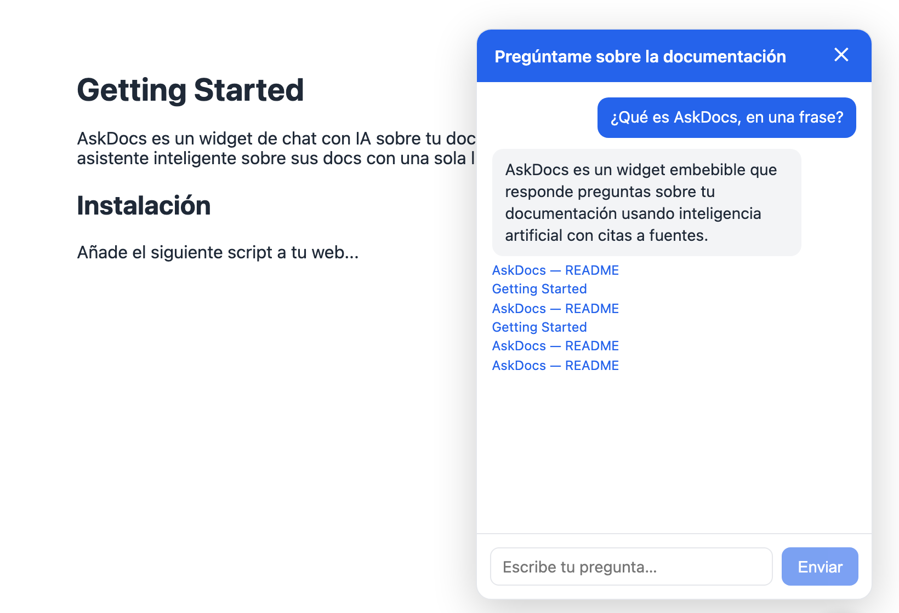

<div align="center">

# AskDocs

**Chat con IA sobre tu documentación. Open source, self-hosted, en una línea.**

Instala un asistente inteligente sobre tus docs con un solo `<script>`.
Tus datos no salen de tu servidor. Funciona con Anthropic, OpenAI o modelos locales.

[Instalación](#instalación) · [Uso](#uso) · [Configuración](#configuración) · [Cómo funciona](#cómo-funciona) · [Roadmap](#roadmap) · [Licencia](#licencia)

</div>

> ⚠️ **Estado: v0.0.1, núcleo funcional.** Server, ingesta, chat con RAG,
> widget, dashboard y Docker ya funcionan de extremo a extremo. Pendiente de
> pulido final antes del lanzamiento público (ver [Roadmap](#roadmap)).

---

## Demo



*(Captura real del widget corriendo contra el stack local. Pendiente
sustituir por un GIF grabado en condiciones antes del lanzamiento.)*

## ¿Qué es?

AskDocs es un widget embebible que responde preguntas sobre tu documentación usando IA, **con citas a las fuentes**. Piensa en el chat de soporte de Intercom, pero open source y que puedes alojar tú mismo.

- **Instalación en < 10 minutos** con Docker Compose.
- **Privacy-first**: en modo self-hosted, los datos nunca salen de tu servidor (salvo las llamadas al proveedor de LLM que tú elijas).
- **Agnóstico de LLM**: Anthropic, OpenAI o modelos locales vía Ollama — para chat y para embeddings, por separado.
- **Respuestas con fuentes**: cada respuesta enlaza a la sección de donde salió. Antes de inventar, responde "No lo sé."

## Cómo funciona

Tres piezas dentro de un monorepo, todas dentro de un único servicio desplegable:

| Paquete | Qué hace |
|---|---|
| `packages/server` | La API: `POST /chat` (RAG con citas), `POST /ingest` (markdown/URL/sitemap), y sirve el widget y el dashboard como estáticos |
| `packages/widget` | El web component embebible (el chat flotante), compilado a un único `widget.js` |
| `packages/dashboard` | Panel para ver el historial de conversaciones y detectar preguntas sin respuesta |

El `server` es el único servicio que despliegas tú (además de Postgres): sirve la API, el widget y el dashboard desde el mismo proceso.

## Instalación

Requisitos previos: [Docker](https://docs.docker.com/get-docker/) y Docker Compose (incluido en Docker Desktop). Node ≥ 20 y [pnpm](https://pnpm.io) solo si quieres desarrollar en local sin Docker.

```bash
git clone https://github.com/mikeljc-dev/askdocs.git
cd askdocs
cp .env.example .env
```

Edita `.env` y rellena como mínimo:

- `ANTHROPIC_API_KEY` (o `OPENAI_API_KEY`, según `LLM_PROVIDER`) — el proveedor para el chat.
- `OPENAI_API_KEY` — necesaria para generar embeddings en la ingesta aunque uses Anthropic u Ollama para el chat (Anthropic no tiene API de embeddings). Alternativa gratuita: `EMBEDDING_PROVIDER=ollama`.
- `ADMIN_TOKEN` — genera uno con `openssl rand -hex 32`. Protege `POST /ingest` y el dashboard.

Levanta todo con un comando:

```bash
docker compose up -d --build
```

Esto levanta Postgres+pgvector, aplica las migraciones automáticamente y arranca el server en `http://localhost:3000`. Compruébalo:

```bash
curl http://localhost:3000/health
# {"status":"ok","version":"0.0.1"}
```

## Uso

### 1. Ingiere tu documentación

```bash
curl -X POST http://localhost:3000/ingest \
  -H "Content-Type: application/json" \
  -H "Authorization: Bearer $ADMIN_TOKEN" \
  -d '{
    "type": "sitemap",
    "source": "https://tudominio.com/sitemap.xml"
  }'
```

`type` puede ser `"url"` (una página), `"sitemap"` (todas las páginas listadas, hasta 200) o `"markdown"` (texto directo, útil para CI o contenido que no está publicado como HTML):

```bash
curl -X POST http://localhost:3000/ingest \
  -H "Content-Type: application/json" \
  -H "Authorization: Bearer $ADMIN_TOKEN" \
  -d '{
    "type": "markdown",
    "url": "https://tudominio.com/docs/instalacion",
    "title": "Instalación",
    "source": "# Instalación\n\n..."
  }'
```

Re-ingerir un documento sin cambios no vuelve a gastar en embeddings (deduplicación por hash de contenido).

### 2. Instala el widget en tu web

Una sola línea:

```html
<script src="http://localhost:3000/widget.js" data-server="http://localhost:3000"></script>
```

En producción, sustituye `localhost:3000` por el dominio donde tengas desplegado el server, y añade el origen de tu web a `ALLOWED_ORIGINS` en `.env`.

### 3. Revisa el historial en el dashboard

Abre `http://localhost:3000/dashboard`, pega tu `ADMIN_TOKEN`, y verás el historial de conversaciones con un filtro para aislar las preguntas sin respuesta — la señal más directa de qué le falta a tu documentación.

## Configuración

Todas las variables viven en `.env` (plantilla en `.env.example`).

| Variable | Descripción | Default |
|---|---|---|
| `DATABASE_URL` | Cadena de conexión a Postgres | — |
| `EMBEDDING_DIMENSIONS` | Dimensiones del vector, debe coincidir con el modelo de embeddings | `1536` |
| `LLM_PROVIDER` | Proveedor de chat: `anthropic` \| `openai` \| `ollama` | `anthropic` |
| `LLM_MODEL` | Modelo de chat (opcional, cada adaptador tiene un default) | — |
| `EMBEDDING_PROVIDER` | Proveedor de embeddings: `openai` \| `ollama` (Anthropic no tiene) | `openai` |
| `EMBEDDING_MODEL` | Modelo de embeddings (opcional) | — |
| `ANTHROPIC_API_KEY` / `OPENAI_API_KEY` | Keys de los proveedores que uses | — |
| `OLLAMA_BASE_URL` | URL del servidor Ollama | `http://localhost:11434` |
| `PORT` | Puerto del server | `3000` |
| `ALLOWED_ORIGINS` | Orígenes permitidos por CORS para el widget, separados por coma | `http://localhost:5173` |
| `ADMIN_TOKEN` | Token que protege `POST /ingest` y `GET /admin/*` (dashboard) | — |
| `CHAT_RATE_LIMIT` | Peticiones por IP y minuto a `POST /chat` (endpoint público) | `20` |

**Sobre embeddings y proveedor de LLM:** son configuraciones independientes a propósito. Puedes usar Anthropic para el chat y OpenAI (o Ollama) solo para generar los embeddings de la ingesta, ya que Anthropic no ofrece API de embeddings propia.

**Sobre `EMBEDDING_DIMENSIONS`:** está fijada en la columna `chunks.embedding` de Postgres desde la primera migración. Si cambias de proveedor/modelo de embeddings después de haber ingerido contenido, necesitas una migración nueva que recree esa columna y volver a ingerir todo.

**Ollama sin coste:** si prefieres cero llamadas a APIs externas y tienes hardware para correrlo, `LLM_PROVIDER=ollama` + `EMBEDDING_PROVIDER=ollama` (con `EMBEDDING_DIMENSIONS=768` para `nomic-embed-text`) funciona igual de bien, solo que localmente. No es el default porque añade fricción de instalación (hay que tener Ollama corriendo) que no encaja con la promesa de "instalación en <10 minutos" para el caso general.

## Desarrollo local (sin Docker)

```bash
pnpm install
pnpm db:up          # solo Postgres+pgvector, vía Docker
pnpm db:migrate
pnpm --filter @askdocs/server dev
pnpm --filter @askdocs/widget dev       # opcional, para trabajar en el widget
pnpm --filter @askdocs/dashboard dev    # opcional, para trabajar en el dashboard
```

## Roadmap

- [x] **Fase 1 — Núcleo:** server, esquema de BD, ingesta (markdown/URL/sitemap), adaptadores de LLM (Anthropic/OpenAI/Ollama), chat con RAG y citas, widget embebible, Docker.
- [ ] **Fase 2 — Lanzamiento:** dashboard ✅, README con guía real ✅ (este documento), pulido final para lanzamiento público (GitHub, Hacker News, r/selfhosted).
- [ ] **Fase 3 — Tracción:** iterar con feedback real, prototipo de versión cloud (multi-tenant, billing por uso), lista de espera.

## Stack

TypeScript en todo el monorepo · pnpm workspaces · [Hono](https://hono.dev) · Postgres + [pgvector](https://github.com/pgvector/pgvector) · [Lit](https://lit.dev) (widget) · [Preact](https://preactjs.com) + Vite (dashboard) · Docker.

## Licencia

[AGPL-3.0](./LICENSE). El núcleo es y será siempre open source. La versión cloud gestionada (de pago) llegará más adelante para quien no quiera mantener la infraestructura.
